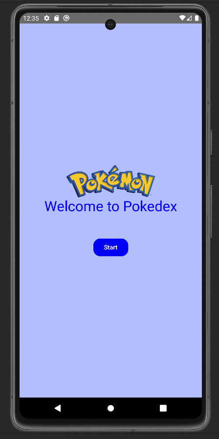
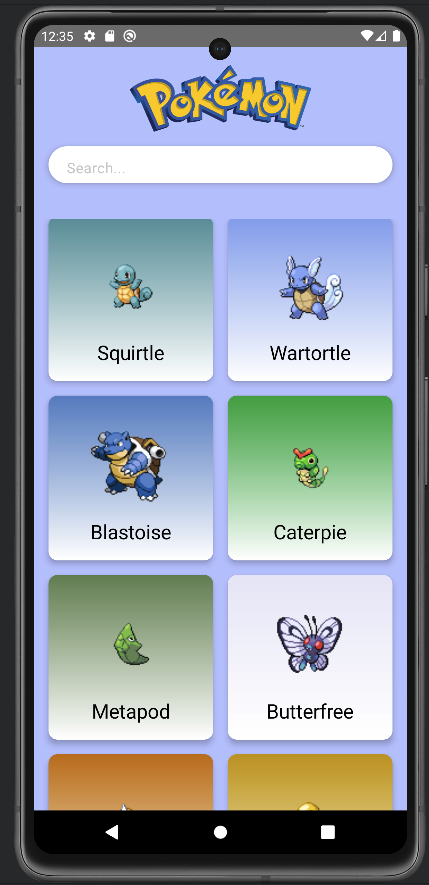
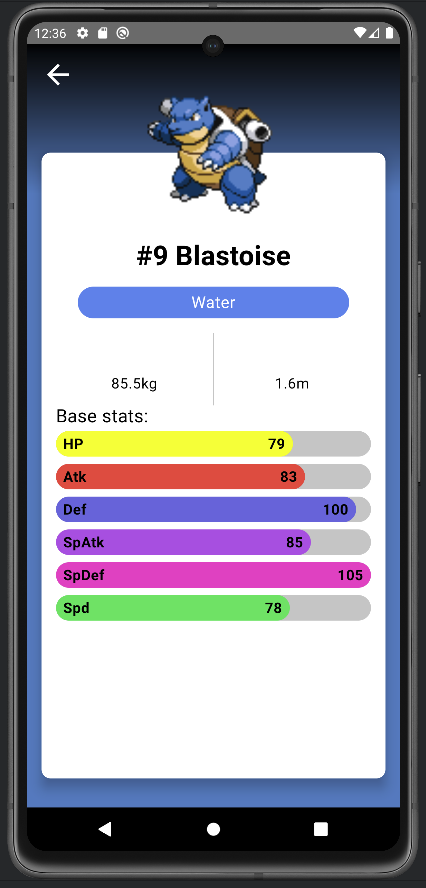

# ProjectMvvmPokedex
Projeto do curso de Pós Gradução da PUCPR - Desenvolvimento de Aplicativos Móveis: Desenvolvimento Mobile Profissional

## Descrição:
Aplicação desenvolvida para dispositivos Andorid, na qual atende a finalidade de apresentar uma aplicação que utiliza dos conceitos de TDD, Arquitetura MVVM (Model-View-ViewModel) e Clean Code.

## Informações Técnicas:
A aplicação foi desenvolvida com a linguagem Kotlin, para dispositivos Android utilizando o framework Jetpack Compose, aos moldes de arquitetura MVVM.

## Tecnologias usadas:
- Kotlin: https://kotlinlang.org/docs/getting-started.html
- Jetpack Compose: https://developer.android.com/jetpack/getting-started?_gl=1*1x0zhkj*_up*MQ..&gclid=Cj0KCQiA6Ou5BhCrARIsAPoTxrBwHX8xa_B6ym6H5WhqsApHYsjK4pB51RvClGhCnpEPzsDVdwU55sEaAlJ0EALw_wcB&gclsrc=aw.ds
- Android Strudio: https://developer.android.com/studio/intro?hl=pt-br
- JUnit: https://junit.org/junit5/
- Dagger: https://dagger.dev/hilt/
- PokeAPI: https://pokeapi.co/

## Imagens:

  
  
  

## Vídeo de demonstração:
https://youtu.be/ieWUhMNIf_8

### Autor:
- Alfredo Paes da Luz.
